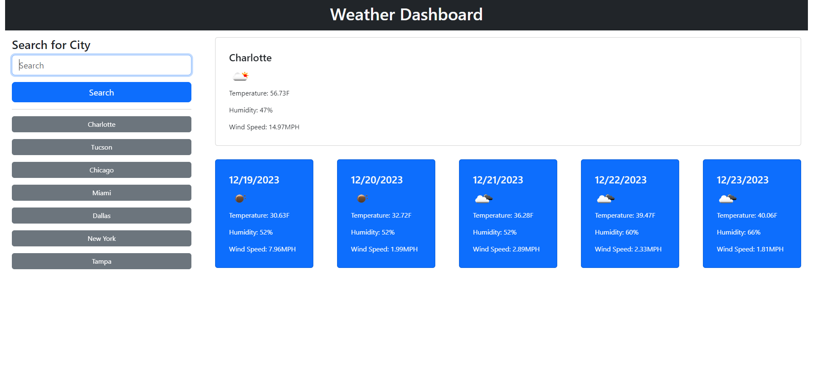

# API Weather App

## Description

In this challenge I used fetch requests to gather data from the Open Weather Map API. Once the data is collected I created cards in my JavaScript and appended the data to the cards to be displayed to the user. The users inputs in the search form will be saved to local storage and a search history will be created via buttons. The buttons also have funtionality so that when they are clicked the corresponding city will be searched.

## Usage

The user is able to enter a city into the search form and will be shown the current days weather data as well as the following five day forcast. The user can then use the search history buttons to look up preciously searched cities.

## Technologies Used

 - Bootstrap
 - DayJS
 - Open Weather Map API

## Screenshot

## Link
[Link to deployed site](https://zacharydotpy.github.io/api-weather-app/)